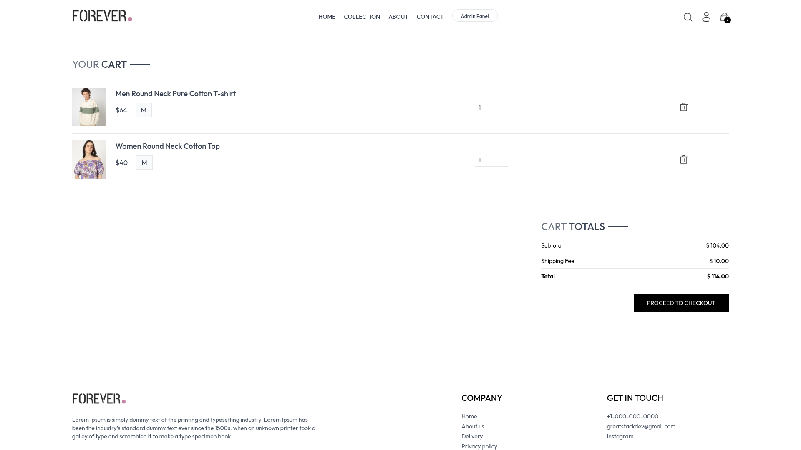
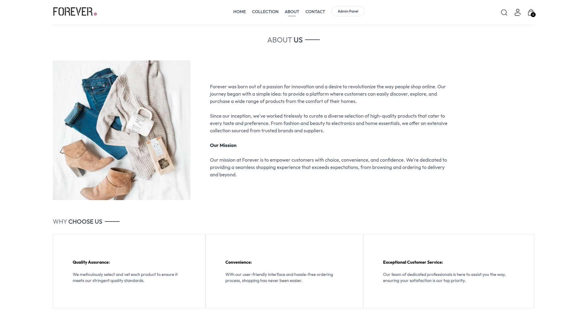
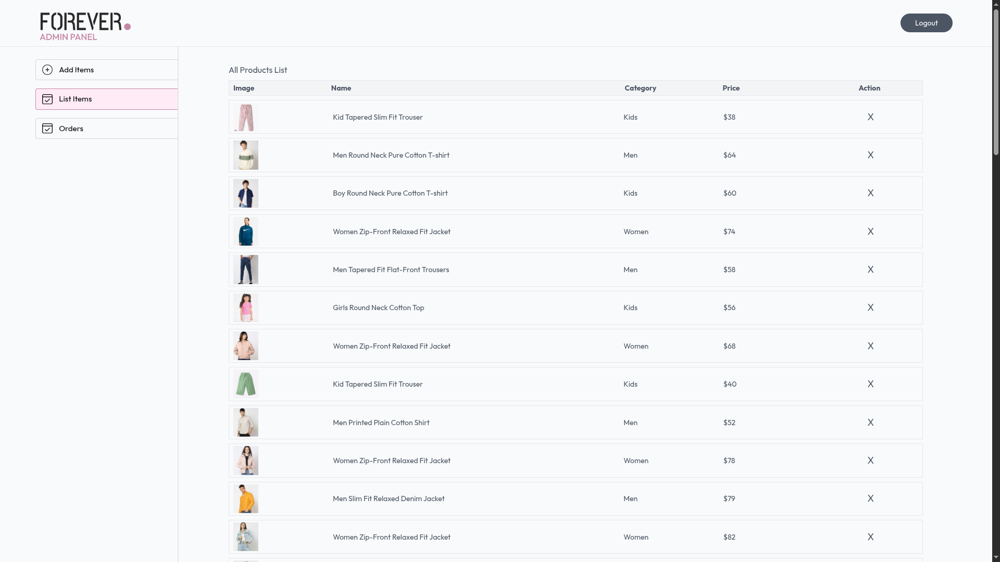

# 🛒 Full-Stack eCommerce Website (Test Project)

This is a fully functional full-stack eCommerce web application built as a personal challenge to test and strengthen my end-to-end development skills. While the UI/UX—especially the admin panel—is basic, the project focuses on building robust backend logic, integrating third-party services, and creating a scalable architecture.

---

## 🔧 Tech Stack & Integrations

- **Frontend:** React (or your specific frontend tech)
- **Backend:** Node.js / Express
- **Database:** MongoDB
- **Image Management:** [Cloudinary](https://cloudinary.com/) for secure image uploads
- **Payment Gateways:**
  - [Stripe](https://stripe.com/) for international payments
  - [Razorpay](https://razorpay.com/) for Indian transactions
- **Authentication & Authorization:** Basic role-based access (user/admin)

---

## 🚀 Purpose & Learnings

- Build a complete full-stack application from scratch
- Integrate third-party services (Cloudinary, Stripe, Razorpay)
- Implement real-world application flows like product management and checkout
- Gain experience with backend APIs, authentication, deployment, and environment management

---

> ⚠️ Note: The UI design, particularly in the admin dashboard, is minimal as this project was intended as a technical exercise rather than a production-ready app.

## 📸 Screenshots

### 🏠 Home Page

### 🛍️ Product Listing Page

### 🛒 Cart Page

### 🔐 About Page

### 📦 Admin Dashboard

